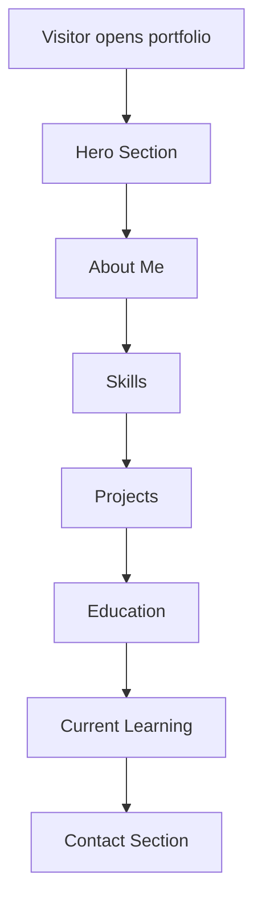
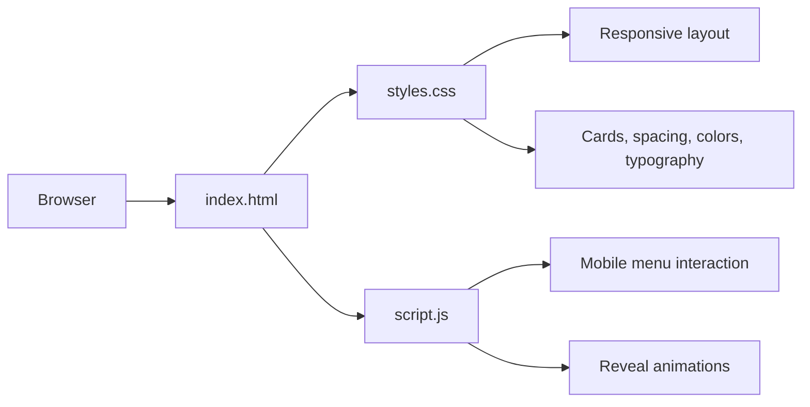

# Almazov Aziret Portfolio Website


A modern personal portfolio website created for **Almazov Aziret**, a senior student at the **American University of Central Asia (AUCA)**.  
The website presents academic background, technical skills, selected projects, learning direction, and contact information in a clean and professional format.

## Project Description

This project solves a simple but important problem: students and beginner developers often need a clear digital space where they can present themselves professionally.  
Instead of sharing information through separate files or messages, this website brings everything together in one responsive and visually polished portfolio.

The portfolio is designed to:

- introduce the student clearly and professionally
- highlight technical interests and skills
- present academic and practical projects
- make contact information easy to find
- provide a strong first impression for teachers, recruiters, and collaborators

## Features and Functionality

- Responsive single-page portfolio layout
- Modern hero section with introduction and call-to-action buttons
- About section with biography and personal qualities
- Skills section with structured technology cards
- Projects section with featured and supporting projects
- Education and current learning sections
- Contact section with email, location, and profile placeholders
- Smooth scrolling navigation
- Mobile navigation menu
- Scroll reveal animations using JavaScript
- Clean dark visual theme with modern typography and card-based design

## Architecture Overview

This is a **frontend-only web application**.  
There is **no backend, API, or database** in the current version because the purpose of the project is presentation and personal branding.

### Frontend

- `index.html` contains the structure and content of the website
- `styles.css` controls layout, color palette, responsiveness, spacing, and animations
- `script.js` handles mobile navigation behavior and scroll-based reveal animations

### Backend

- Not applicable for this version

### API

- Not applicable for this version

### Database

- Not applicable for this version

## UI / Application Structure



## Frontend Architecture Diagram



## Tech Stack

- HTML5
- CSS3
- JavaScript (Vanilla JS)
- Google Fonts

## Project Structure

```text
part/
├── index.html
├── styles.css
├── script.js
├── README.md
└── .gitignore
```

## Main Sections of the Website

### 1. Hero Section

- Personal introduction
- Subtitle with academic and career direction
- Short summary
- Buttons for projects and contact

### 2. About Me

- AUCA student background
- Technical interests
- Personal strengths and teamwork qualities

### 3. Skills

- HTML
- CSS
- JavaScript
- React
- Node.js
- MongoDB
- SQL / MySQL
- Python
- C++
- Machine Learning Basics
- Git / GitHub
- Responsive Web Design

### 4. Projects

- **Online Store Website** as the featured project
- **Machine Learning Price Prediction Project**
- **Database Design Project**

### 5. Education and Learning

- AUCA senior student information
- Current learning goals in full-stack development, databases, and machine learning

### 6. Contact

- Name
- Email
- Location
- Placeholder links for GitHub and LinkedIn

## Setup and Run Instructions

### Option 1: Open directly

1. Download or clone the repository
2. Open `index.html` in any browser

### Option 2: Run with a local server

```bash
git clone https://github.com/Aziret0407/Partfolio-.git
cd Partfolio-
python3 -m http.server 8000
```

Then open:

```text
http://localhost:8000
```

## Screenshots or UI Diagrams

This repository currently includes **UI diagrams** in the README instead of screenshots.  
If needed later, screenshots of the homepage, skills section, and projects section can be added to a `screenshots/` folder.

## Why This Project Matters

This project presents the developer as:

- a motivated AUCA senior student
- a beginner software engineer with practical interests
- someone focused on web development, programming, databases, and machine learning

It can be used for:

- university presentations
- final project submission
- internship applications
- personal branding

## Future Improvements

- Add real GitHub and LinkedIn profile links
- Add downloadable CV
- Add a contact form with backend support
- Connect projects to live demos or repositories
- Add multilingual support

## Author

**Almazov Aziret**  
AUCA Senior Student  
Email: `aa12503@auca.kg`
